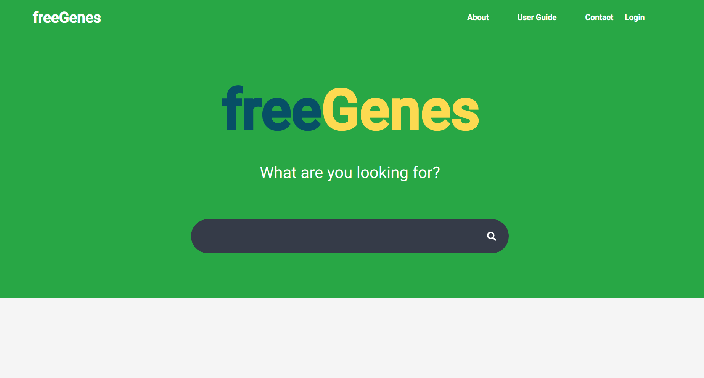

# FreeGenes Django

 - [Documentation](https://vsoch.github.io/freegenes-django)

## What is FreeGenes?

FreeGenes is an intiative by the BioBricks Foundation to create
an open technology commons. You can read more about it [here](https://biobricks.org/freegenes/).

## Images Included

FreeGenes Django consists of several Docker images, and they are integrated 
to work together using [docker-compose.yml](docker-compose.yml). 
The images are the following:

 - **quay.io/vsoch/freegenes**: is the main uwsgi application, which serves a Django (python-based) application.
 - **nginx**: pronounced (engine-X) is the webserver. The starter application is configured for http, however you should follow the instructions to set up https properly. Note that we build a custom nginx image that takes advantage of the [nginx upload module](https://www.nginx.com/resources/wiki/modules/upload/).
 - **worker**: is the same uwsgi image, but with a running command that is specialized to perform tasks. The tasks are run via [django-rq](https://github.com/rq/django-rq) that uses a
 - **redis**: database to organize the jobs themselves.
 - **scheduler** jobs can be scheduled using the scheduler.

If you have any issues, please [open on the issue board](https://github.com/singularityhub/sregistry/issues).

## License

This code is licensed under the MPL 2.0 [LICENSE](LICENSE).
